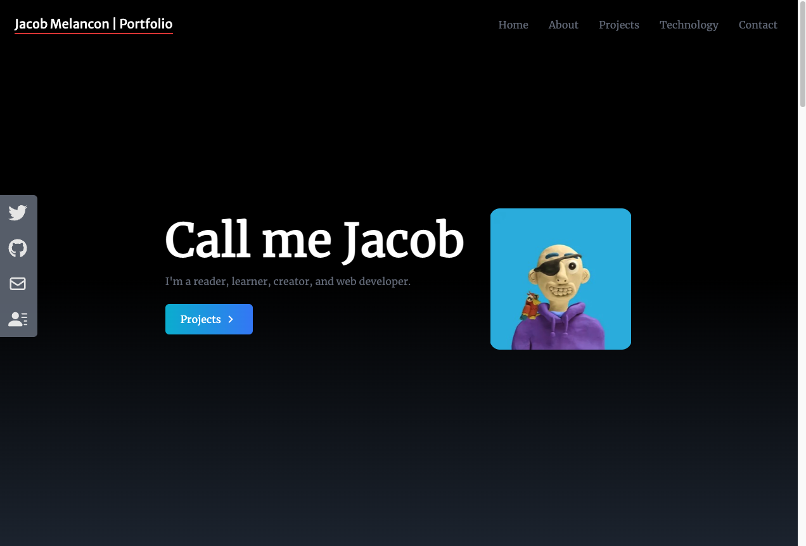
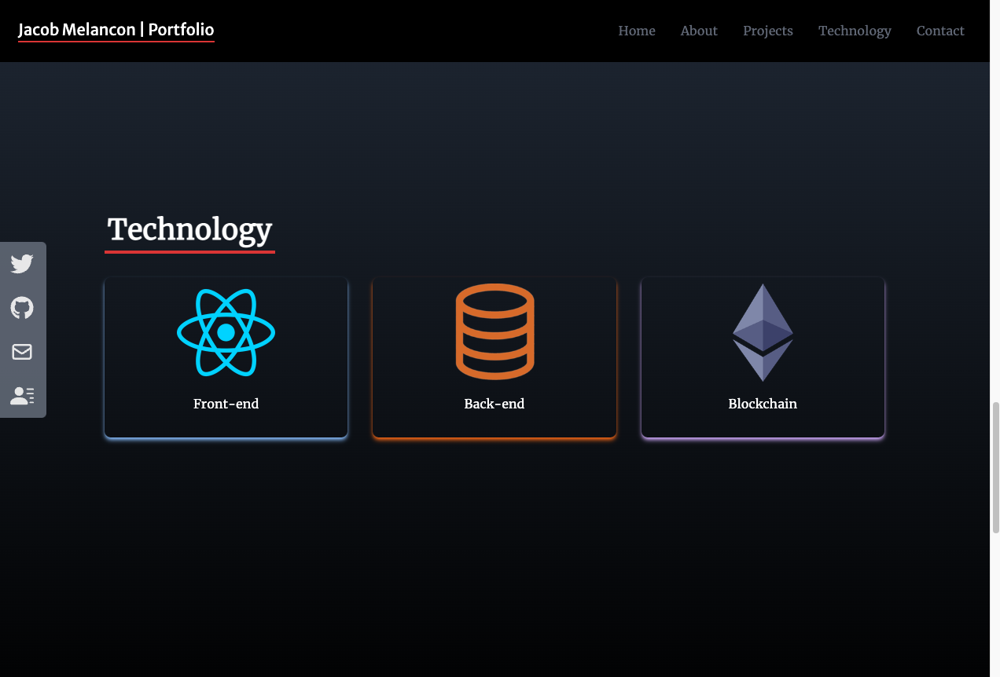
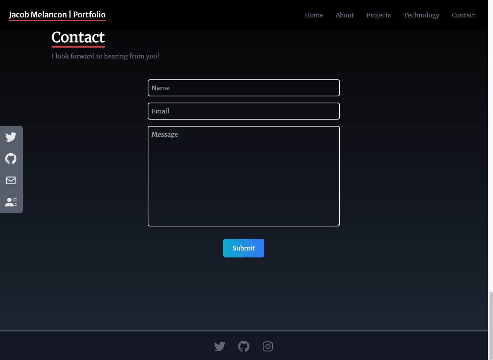

# Portfolio Website

A fully functional developer portfolio website.

This project was bootstrapped with [Create React App](https://github.com/facebook/create-react-app).

<h1>Tools Used</h1>
<li>React</li>
<li>HTML</li>
<li>TailWind CSS</li>
<li>Javascript</li>

<h2>Acknowledgements</h2>

-This project began as part of a <a href ="https://www.youtube.com/watch?v=LpZrAjU6Hhk&t=364s">youtube tutorial</a> presented by "Prgramming With Yash".

-Stylistic and functional changes were made to tailor the site to my own needs.

<h2>Links</h2>
Website: https://jakecodes.net
